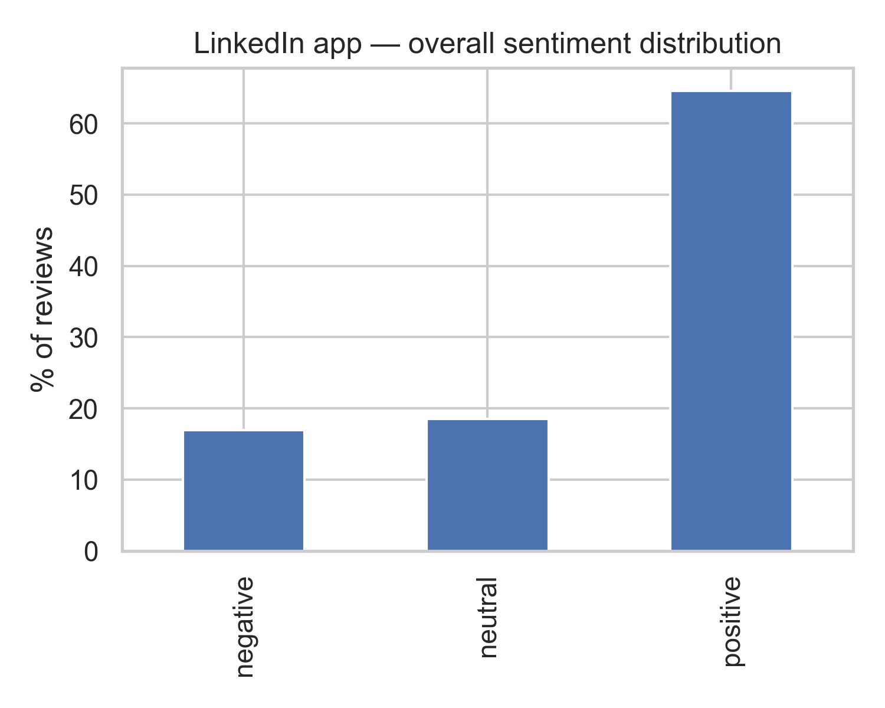
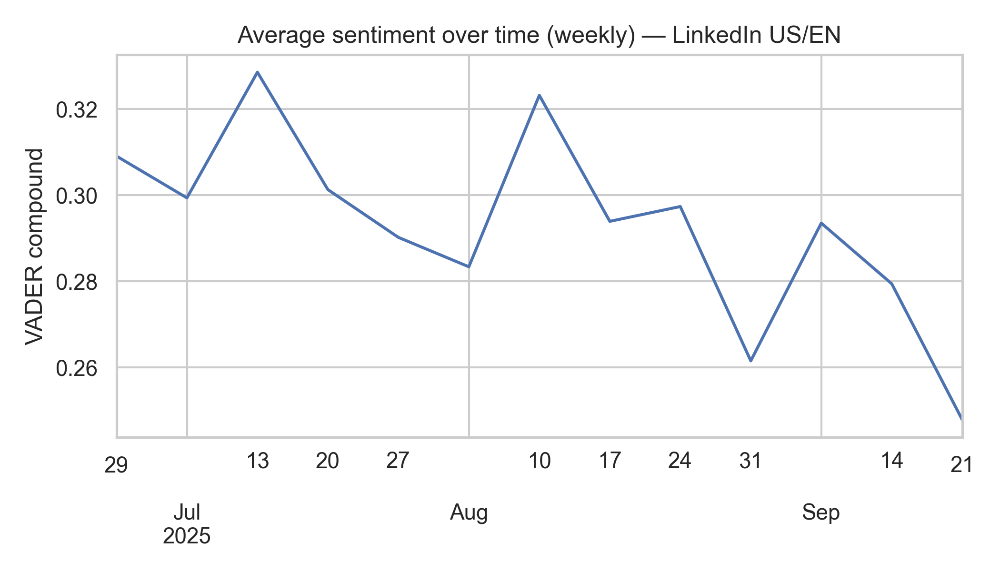
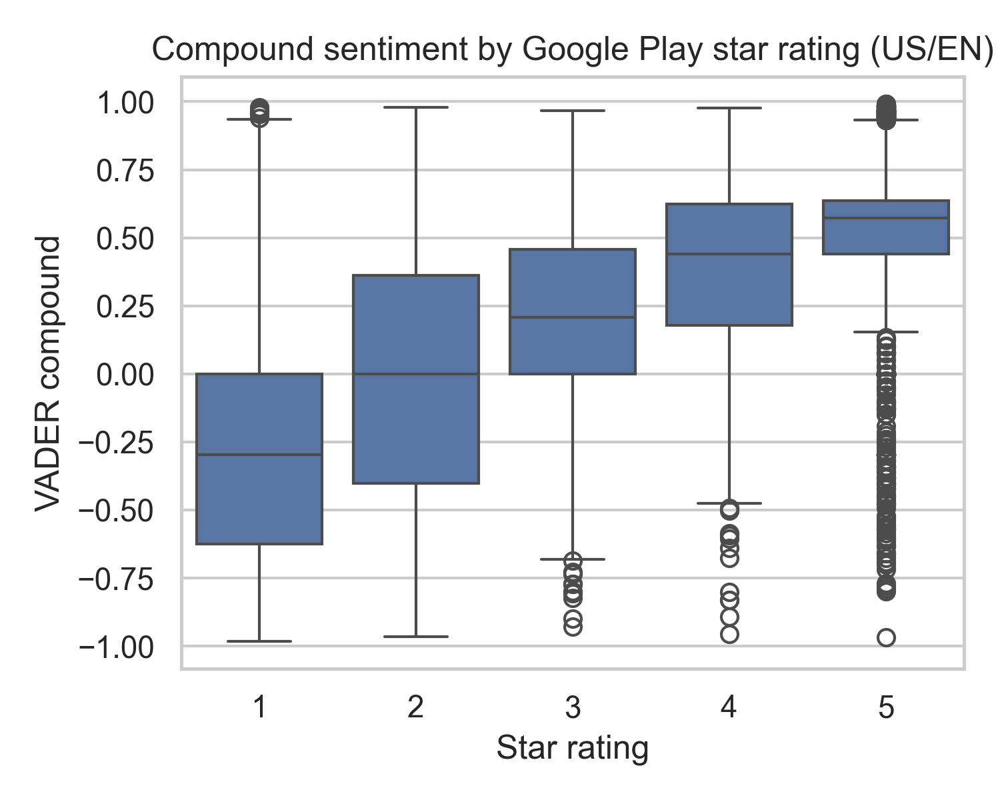

# 📱 Review_Sentiment_Analysis

## 📌 Project Overview
This project analyzes **10,000 Google Play Store reviews** of the LinkedIn Android app (US, English only).
I collected reviews using the `google-play-scraper` package, applied sentiment analysis with **VADER (NLTK)**, and visualized user sentiment trends.

The goal is to understand **user sentiment patterns**, identify **pain points**, and highlight how sentiment aligns with **star ratings and time**.

## 📊 Dataset
- **Source:** [Google Play Store](https://play.google.com/store/apps/details?id=com.linkedin.android&pli=1)
- **App:** LinkedIn (Android)
- **Scope:** 10,000 reviews (US, English only)
- **Fields collected:** `reviewId`, `userName`, `rating`, `date`, `review`, `developer reply`
- **Tools:** `google-play-scraper` (Python package)
⚠️ Raw data is excluded from GitHub for size/privacy.
You can re-run `01_collect_reviews.ipynb` to scrape reviews yourself.

## 🛠️ Methodology
1. **Data Collection** (`01_collect_reviews.ipynb`)
    - Scraped 10,000 reviews (US/EN) via Google Play API
    - Deduplicated and cleaned text
2. **Sentiment Analysis** (`02_sentiment_analysis.ipynb`)
    - Pre-processed text (removed links, special characters, etc.)
    - Applied **NLTK VADER** sentiment analyzer
    - Classified reviews into `positive`, `neutral`, or `negative`
3. **Visualization & Insights**
    - Distribution of sentiment
    - Weekly sentiment trend
    - Relationship between sentiment and Google Play star ratings
  
## 📈 Results & Insights
### Overall Sentiment Distribution

- ~68% **positive**, ~15% **negative**, ~17% **neutral**
- Positive reviews often highlight networking and job features.
- Negative reviews commonly mention **login issues, bugs, and app crashes**.

### Sentiment Over Time (Weekly Average)

- Sentiment fluctuates weekly, with dips around late August and early September.
- Indicates possible **impact of app updates** on user satisfaction.

### Sentiment vs. Star Rating

- Strong alignment:
    - **1★ reviews →** mostly negative sentiment
    - **5★ reviews →** strongly positive
- Confirms VADER sentiment scores are consistent with explicit ratings.

## 💡 Business Implications
- **Login & stability issues** drive a large portion of negative sentiment → critical area for improvement.
- **Networking and job-related features** are the app’s strongest drivers of positive sentiment.
- **Monitoring sentiment trends** over time can help detect the impact of feature updates or bugs.

## ⚖️ Limitations & Next Steps
- Reviews are **self-selected** and may not represent all users.
- Only **English/US** reviews were analyzed — excludes international/local perspectives.
- Future extensions:
    - Multi-language sentiment models
    - Topic modeling (LDA/BERT) for deeper theme extraction
    - Longer-term time series analysis with changelog/event overlay
 
## ⚙️ Installation
Clone this repository and install dependencies:

```bash
git clone https://github.com/aituar17/Review_Sentiment_Analysis.git
cd Review_Sentiment_Analysis
pip install -r requirements.txt
```

⚠️ To reproduce results, run `01_collect_reviews.ipynb` to fetch fresh reviews.

## 📂 Project Structure
```plaintext
Review_Sentiment_Analysis/
├── data/ # Dataset folder (not uploaded to GitHub due to size; see data/README.md)
├── images/ # Saved plots for README 
│ └── sentiment_distribution.png
│ └── sentiment_over_time.png
│ └── sentiment_by_rating.png
├── notebooks/ # Jupyter notebooks with full scraping and analysis
│ └── 01_collect_reviews.ipynb
│ └── 02_sentiment_analysis.ipynb
├── .gitignore # Ignore large files (e.g., dataset)
├── README.md # Project documentation
└── requirements.txt # Dependencies for reproducibility
```
